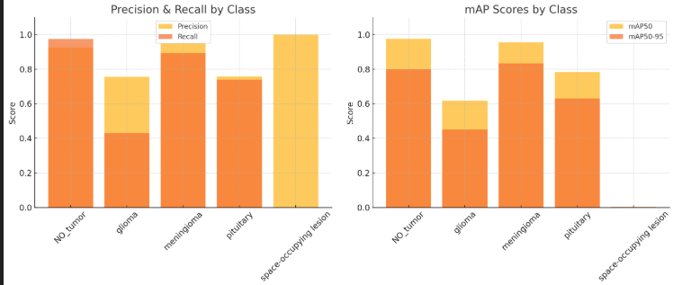
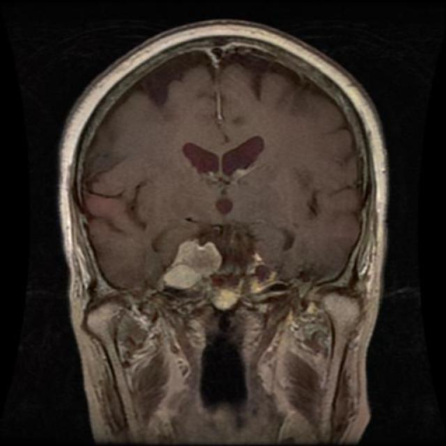
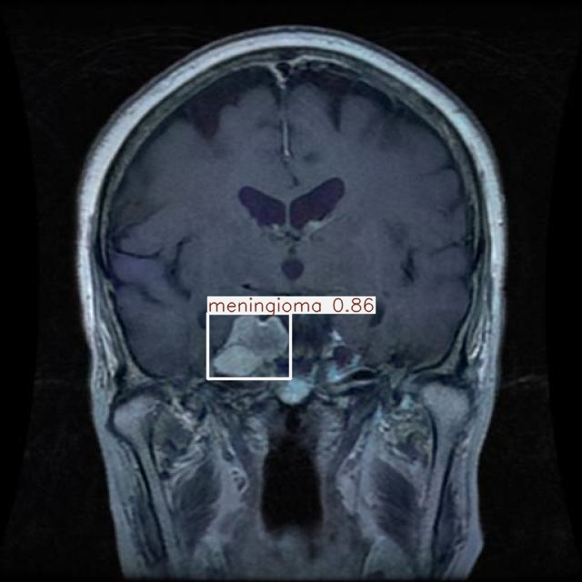
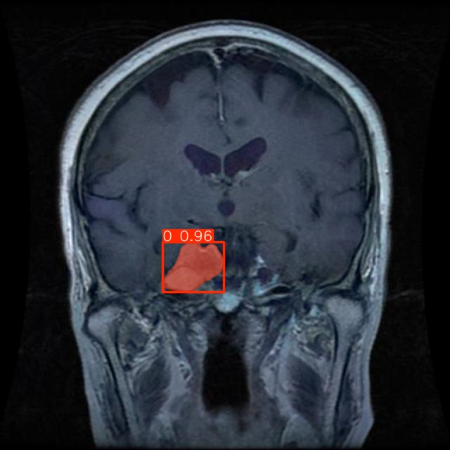

# 🧠 Tumor Detection App

This project is a simple web application built with **Streamlit** that uses **YOLO** (for object detection) and **SAM** (for segmentation) to detect and segment tumors in MRI images.

## ✨ Features

- Upload medical images (MRI scans).
- Detect tumor regions using a YOLOv11 model.
- Refine detected regions using SAM (Segment Anything Model).
- Visualize detections and segmentations.

---

## 🚀 How to Run the App

1. **Clone the Repository**

```bash
git clone https://github.com/Agent47c/BrainTumorModel.git
cd BrainTumorModel
```

2. **Install Dependencies**

Make sure you have Python 3.8+ installed.

```bash
pip install -r requirements.txt
```

Example dependencies:

```
streamlit
ultralytics
Pillow
numpy
```

*(You might need to manually install `SAM` if not available through pip depending on the version you're using.)*

3. **Prepare Models**

- Place your trained YOLO model weights (e.g., `best.pt`) in the project directory or update the path in the code.
- Make sure the SAM model is available at the correct path (replace `"SAM 2 Model Location"` in the code with your trained SAM model).

4. **Run the App**

```bash
streamlit run app.py
```

5. **Open in Browser**

Streamlit will open a new tab automatically. If not, go to:

```
http://localhost:8501
```

---

## 📷 How to Use

1. Upload an MRI image (supported formats: JPG, JPEG, PNG, BMP, GIF, TIFF).
2. Click the **Predict** button.
3. The YOLO model will detect potential tumor regions.
4. The SAM model will then perform fine-grained segmentation of detected regions.
5. Visualized outputs for both YOLO and SAM will be displayed.

---

## 📂 Project Structure

```bash
tumor-detection-app/
├── uploads/                # Uploaded images will be saved here
├── best.pt                 # YOLO model weights
├── app.py                  # Main Streamlit application
├── requirements.txt        # Python dependencies
├── screenshots/            # Screenshots and charts
└── README.md               # This file
```

---

## ⚙️ Configuration

In the code:

- **YOLO Model**:  
  Change `"best.pt"` to your actual YOLO model file if needed.

- **SAM Model**:  
  Update `"SAM 2 Model Location"` with the path or checkpoint of your SAM model.

```python
return SAM("path_to_sam_checkpoint.pth")
```

---

## 📊 Model Performance

The following are evaluation results from the YOLOv11 model used in this project on the test dataset:

```
Class                       Images  Instances      P       R     mAP50  mAP50-95
--------------------------------------------------------------------------------
all                            395        415   0.878   0.607    0.666     0.543
NO_tumor                       115        116   0.925   0.974    0.975      0.8
glioma                          30         36   0.756    0.43    0.618     0.451
meningioma                     144        148    0.95   0.892    0.954     0.833
pituitary                      106        111   0.757   0.739    0.782      0.63
space-occupying lesion           1          4   1.000   0.000   0.00298   0.00268
```

- **P**: Precision  
- **R**: Recall  
- **mAP50**: Mean Average Precision at IoU threshold 0.5  
- **mAP50-95**: Mean Average Precision averaged across IoU thresholds from 0.5 to 0.95  

> 📌 *Note:* The model performs well across most tumor types, though performance is limited on underrepresented classes like *space-occupying lesion* due to low sample size.

---

### 📈 Metrics Chart



---

## 🔥 Demo

| Upload Image | YOLO Detection | SAM Segmentation |
|:------------:|:--------------:|:----------------:|
|  |  |  |

---

## 🤝 Contribution

Feel free to open issues, suggest improvements, or create pull requests!

---

## 📄 License

This project is open source under the MIT License.
